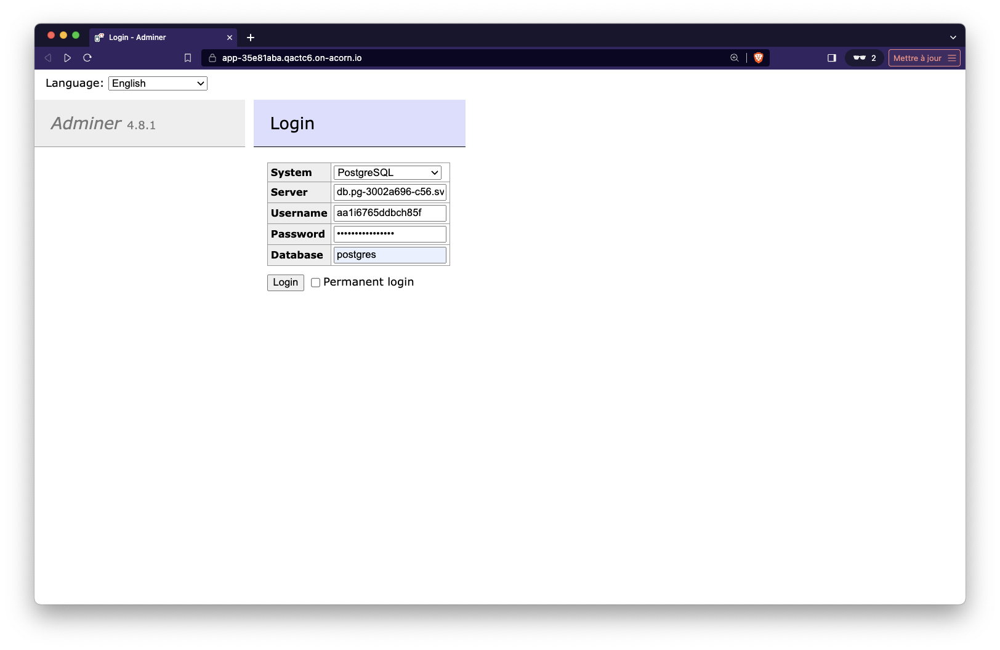
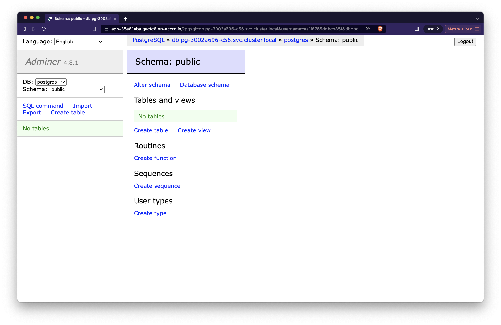

# Postgres

## About

This Acorn provides a Postgres database as an Acorn Service. This Acorn can be used to create a database for your application during development. It runs a single Postgres container which can be backed by a persistent volume is the *persistency* argument is set to *true*. 

A default user is automatically generated during the creation process.

## Usage example

First run the service:

```
acorn run -n pg
```

Next run the app defined in the *Acornfile-app*:

```
acorn run -f Acornfile-app -n app
```

Note: the *Acornfile-app* define a single container based on *adminer*, a tool used to connect to different types of databases:

```
services: db: {
		external: "pg"
}

containers: adminer: {
  image: "adminer"
  ports: publish: "8080/http"
  env: {
    ADMINER_DEFAULT_SERVER: "@{service.db.address}"
  }
}
```

Next get the username / password from the secrets generated by the service:

```
$ acorn secret reveal pg.username pg.password
NAME          TYPE      KEY       VALUE
pg.username   token     token     aa1i6765ddbch85f
pg.password   token     token     hjh8730bfdj00ah9
```

Using those credentials we can then use the [Adminer web ui](https://www.adminer.org/) to connect to the database:


  
